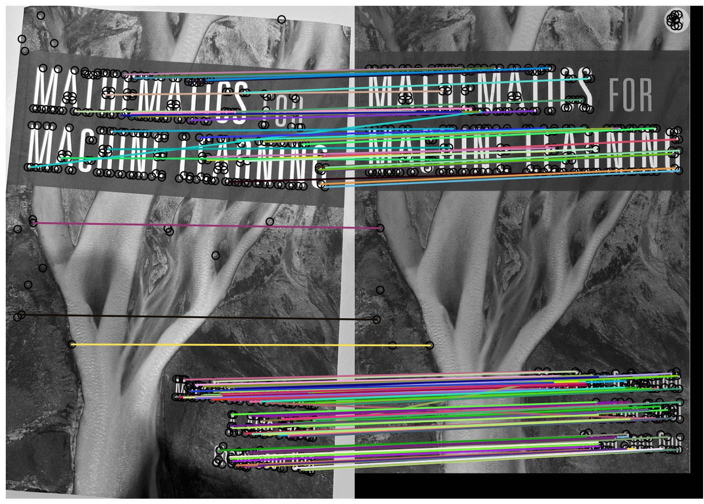

# Tutorial on ML applications to Text and Image Data

This guide's purpose is to introduce new researchers to core concepts in machine learning (ML),
natural language processing (NLP), computer vision (CV), and information retrieval (IR).
Each of these concepts (perhaps with the exception of computer vision) are now increasingly
being used in software engineering (SE) and computer security research and applications.
This guide will introduce core concepts, but it will also highlight certain ideas that I find
be particularly interesting, often because I find that they are often overlooked.

This guide is not intended to cover all topics in depth --- there are many topics that will not be covered here.

## Contents
[Working with Text Data](#working-with-text-data)
 - [Computing Similarity Scores and Distance Metrics](#computing-similarity-scores-and-distance-metrics)
 - [Text Classification with Bag-of-Words](#text-classification-with-bag-of-words)
 - [Text Classification with Embeddings](#text-classification-with-embeddings)
 - [Zero-Shot Classification](#zero-shot-classification)
 - [Other Text-based Methods](#other-text-based-methods)

[Working with Images](#working-with-images)
 - [Image Embeddings](#image-embeddings)
 - [Zero-Shot Image Classification](#zero-shot-image-classification)
 - [Image Matching](#image-matching)

# Machine Learning

A typical machine learning task is to classify inputs into one of k categories.
This is "classification", and the inputs can be text (i.e., strings of characters),
images, audio, etc. You might see this as

f(x) = y

where f is the machine learning model, x is the input, and y is the class category label.
Training a model f typically entails using a learning algorithm to optimize the "weights" or
"parameters" of f from an initial state to a state where the overall error across all training
samples is minimized. There are many learning algorithms, models, and ways of measuring error.
This guide won't cover any of these in detail, but instead it will cover a few examples as 
a way to get you started on using these models on real data.

# Working with Text Data

Common machine learning tasks in the text domain include classification.
Particular applications include sentiment analysis, where we might seek to develop a
model that can classify whether a text is postive or negative sentiment.
For instance, the text "the movie was great, 5 stars definitely recommended" is
a positive sentiment. 
In computer security, text classification can also be used, e.g., for classifying 
whether a file is malware or not, classifying which optimization flags were
used to produce a binary, etc.

To get started, we'll play around with the Clinc-150 dataset, which is a large dataset
for the task of intent classification, or identifying the intent behind a hypothetical
human user's query to a chatbot-style system.
For instance, the query "what time is it" should be classified as the "time" intent
according to this dataset.

The Clinc-150 dataset is a saved in the form of a JSON file, which can be loaded
in Python with the built-in `json` package of functions:

```python
import json

clinc150_file = 'clinc150.json'
with open(clinc150_file, 'r') as f:
    clinc150_data = json.load(f)
```

The data if partitioned into train, test, and validation "splits", each can be accessed with

```python
train = clinc150_data['train']
test = clinc150_data['test']
val = clinc150_data['val']
```

When dealing with classification data, it's never a bad idea to analyze the distribution of
class categories in the dataset.
This is because many machine learning models will be "biased" towards samples from well-
represented classes if the dataset is unevenly distributed across class categories.
Similarly, evaluation metrics like accuracy are biased toward weighing the performance
of the model on the over-represented classes more than the less-represented classes.

##### NLP Task 1
```
Compute counts for each class category in the Clinc-150's train split.
```

When dealing with text data, it's never a bad idea to analyze the makeup of the data.
For instance, we can find out which words appear most frequently in the data.
To do this, we can tokenize each query into a sequence of tokens, then count which
tokens are most common using a frequency map.

A simple and straightforward way to tokenize is to split each query on whitespace.
We should also be careful to "normalize" each query by downcasing each character,
and separating punctuation away from the ends of words. Note that the way that 
tokenization and normalization are implemented should depend on the nature of the
data; that is, text is tokenized differently for human language (e.g., Clinc-150)
versus a code file written in C++. 

The following code will do this on a list of queries:

```python
def simple_tokenizer(text):
    tokens = text.split()
    return tokens

for i, query in enumerate(queries):
    query = query.lower()
    query = simple_tokenizer(query)
    queries[i] = query
```

##### NLP Task 2
```
Compute the most common tokens for the `balance` intent in Clinc-150's train split, and then again in it's test split.
```

##### NLP Task 3
```
How many samples in the `balance` intent contain the tokens `balance`? How many in the `balance` intent contain the tokens `balance` and `what`?
```

## Computing Similarity Scores and Distance Metrics
Often it is valuable to compute how similar two texts are to each other,
or how much overlap there is between one dataset of texts and another dataset of texts
(for instance, measuring the overlap between the test split of the Clinc-150 dataset and
its training split).
There are many ways to do this, and we'll start by looking at an older, simpler technique.

The [Jaccard similarity](https://en.wikipedia.org/wiki/Jaccard_index) between two sets A and B is defined as 
```
jaccard(A, B) = |A \intersect B| / |A \union B|
```

##### NLP Task 4
```
Create a function to compute the jaccard similarity between two lists. (In the function you can cast the lists to sets and then use Python's set operations.)
```

We can compare two texts using the Jaccard similarity by simply extracting each text's
tokens, and then converting these token lists to sets.
Converting the sequential list of tokens to a set effectively disregards the order in
which the tokens appear in the text, almost like we place each (unique) token into a
bag that can be shuffled around.
In fact, this is what's called a ["bag-of-words"](https://en.wikipedia.org/wiki/Bag-of-words_model) representation of text. 

##### NLP Task 5
```
Compute similarity scores between each of the `balance` test split samples and the corresopnding training split. What are some of the pairs with the highest similarity scores?
```

A more sophisticated approach to computing similarity between two texts involves 
using an "embedding" method that maps text to a vector space.
(If you're unfamiliar with vectors, I recommend Chapters 1 and 3 from [this book](https://web.stanford.edu/~boyd/vmls/vmls.pdf).) 
Examples of this approach include [word embeddings](https://en.wikipedia.org/wiki/Word_embedding) (e.g., word2vec, GLoVE, etc.)
as well as sentence embeddings.
For instance, a sentence embedding can map a short text into a d-dimensional vector
(usually d is ~512 dimensions), where to similar texts are typically mapped
to similar feature vectors, where the distance between the two vectors is small,
and similarly, the similarity between the two feature vectors is high.

Let's use a sentence embedder from the [Sentence-Transformers](https://www.sbert.net/) library.

```python
from sentence_transformers import SentenceTransformer

model = SentenceTransformer('all-MiniLM-L6-v2')

s1 = "what is my bank balance"
s2 = "how much money do i have"
s3 = "will it rain today"

e1 = model.encode([s1])[0]
e2 = model.encode([s2])[0]
e3 = model.encode([s3])[0]
```

Distance between two vectors can be computed using [euclidean distance](https://en.wikipedia.org/wiki/Euclidean_distance#Higher_dimensions).
Using [numpy](https://numpy.org/), this is just
```python
import numpy as np
def euclidean_distance(u,v):
    return np.linalg.norm(u-v)
dist_12 = euclidean_distance(e1, e2)
```

The [cosine similarity](https://en.wikipedia.org/wiki/Cosine_similarity) score is a common similarity metric.
It's defined as 
```
cos_sim(u, v) = (u * v) / ||u||x||v||
```
where `u * v` is the vector [dot product](https://en.wikipedia.org/wiki/Dot_product) between `u` and `v`, `||u||` is the vector [norm](https://en.wikipedia.org/wiki/Norm_(mathematics)#Euclidean_norm) of `u`, and `x` is scalar multiplication.

##### NLP Task 6
```
Write a function to compute cosine similarity between two vectors. Compute the cosine similarity between each pair in the example above.
```

## Text Classification with Bag-of-Words

In this section we'll explore several methods for training text classifiers.

The first method uses ["bag-of-words"](https://en.wikipedia.org/wiki/Bag-of-words_model) feature representations of text.
Instead of manually converting text strings to token lists, and then to sets,
we'll use the [sklearn library](https://scikit-learn.org/stable/index.html), which has some useful built-in functionality for this.
We will use sklearn's [CountVectorizer](https://scikit-learn.org/stable/modules/generated/sklearn.feature_extraction.text.CountVectorizer.html#sklearn.feature_extraction.text.CountVectorizer), which produces a [sparse vector](https://www.cs.umd.edu/Outreach/hsContest99/questions/node3.html) representation for each text sample.
Given a text, the vectorizer will produce a vector where each word in
the dataset corresponds to a particular index position in the vector.
If the text contains the word corresponding to index i, then the ith
element of the vector will be the frequency that word occurs in the text.
Otherwise --- if the word does not appear in the text --- then the vector will have a 0 in that position.

To keep things simple, we'll also be using a small subset of the Clinc-150 dataset.

```python
import json
from sklearn.feature_extraction.text import CountVectorizer

with open('clinc150.json', 'r') as f:
    data = json.load(f)
labels = ['balance', 'income', 'routing_number']

def subset(split, labels):
    keeps = []
    for split in [train, test]:
        for (sample, label) in split:
            if label in labels:
                # keep it
                keeps.append((sample, label))
    return keeps

train = subset(data['train'], labels)
test = subset(data['test'], labels)

feature_extractor = CountVectorizer()
x_train = feature_extractor.fit_transform([text for (text, _) in train])
x_test = feature_extractor.transform([text for (text, _) in test])
y_train_labels = [label for (_, label) in train]
y_test_labels = [label for (_, label) in test]
```

We'll also use a model called an [SVM (Support Vector Machine)](https://en.wikipedia.org/wiki/Support_vector_machine) to use as our text classifier model, again using [sklearn's implementation of the SVM](https://scikit-learn.org/stable/modules/classes.html#module-sklearn.svm).
The model expects numeric values for the labels, so we'll quickly perform a mapping from textual labels
("balance", "income",...) to numeric (0,1,...).
The snippet below trains this model on the extracted features:

```python
from sklearn import svm

label_map = {'balance': 0, 'income': 1, 'routing_number': 2}
y_train = [label_map[label] for label in y_train_labels]
y_test = [label_map[label] for label in y_test_labels]

clf = svm.SVC(probability=True)
clf.fit(x_train, y_train)
```

Once we've trained the model, we can perform "inference" and use the model to make predictions on the test data.
We'll run it on the test set here:

```python
predictions = clf.predict(x_test)
```

and to run predictions on new samples:

```python
def predict(text, vectorizer, model):
    features = vectorizer.transform([text])
    output = model.predict(features)
    return output

print(predict("what is my balance please", feature_extractor, clf))
```

Often it's useful to have the classification model output confidence scores along with its predictions.
The confidence scores can be helpful for determining how much trust we can put into the prediction.
This particular model outputs confidence scores between 0 and 1, so that we can think of them as probabilities.
Let's update the `predict` function:

```python
def predict(text, vectorizer, model):
    features = vectorizer.transform([text])
    output = model.predict_proba(features)
    return output

print(predict("what is my balance please", feature_extractor, clf))

print(predict("a random example here", feature_extractor, clf))
```

## Text Classification with Embeddings

Just like before where we used embeddings to help measure the similarity between texts, 
we can use embeddings as features that the classification model can learn and train on.
Let's use the same Sentence-Transformers package to extract embedding from the data from the previous example:

```python
from sentence_transformers import SentenceTransformer

feature_extractor = SentenceTransformer('all-MiniLM-L6-v2')

x_train_emb = feature_extractor.encode([x for (x, _) in train])

clf_emb = svm.SVC()
clf_emb.fit(x_train_emb, y_train)
```

We've trained two different SVM models, one using bag-of-words features and the other using sentence embeddings.
We can compare them based on their speed, as well as their performance on the test set.
The sklearn package includes functions for performance measurements.
For example, we can compute the [accuracy](https://scikit-learn.org/stable/modules/model_evaluation.html#accuracy-score) on some hypothetical predicted labels with the following:

```python
from sklearn.metrics import accuracy_score
y_predicted = [0,1,2,1,0]
y_true = [0,1,2,2,1]
print(accuracy_score(y_predicted, y_true))
```

##### NLP Task 7
```
Compare the accuracy of both models.
```

An interesting problem in machine learning --- especially in classification tasks --- is how to handle
inputs that the model was not trained to expect.
For instance, the input `"this is a random example"` does not belong to any of the three classes
that the model was trained on --- it is what we might call "out-of-scope".
There are many ways to measure the performance of a model on these
types of out-of-scope samples.
One way is to cast this problem a binary classification problem,
and use the [AUC metric](https://en.wikipedia.org/wiki/Receiver_operating_characteristic#Area_under_the_curve) on the predicted confidence scores.

Let's set up some fake data, assuming that it was produced by a classification model:

```python
confidence_scores = [0.9, 0.2, 0.8, 0.85, 0.4, 0.99, 0.3, 0.97, 0.6, 0.5]
in_or_out_of_scope = [1, 0, 1, 0, 0, 1, 1, 1, 0, 1] # 1 is in-scope, 0 is out-of-scope
```

When working with a model that can output confidence scores and where it might encounter out-of-scope inputs,
we'd ideally like out-of-scope samples to yield low-confidence scores, and in-scope samples to yield high-confidence scores.
The AUC metric measures how well the model does at this: the AUC score will be high if the model can produce mostly high-confidence
scores for in-scope inputs, and low-confidence scores for out-of-scope inputs; the AUC score will be low if the model produces 
confidence scores that are similar for both in- and out-of-scope samples.
Additionally, the range of the AUC score is between 0.5 and 1.0.
Let's compute it for this fake data:

```python
from sklearn.metrics import roc_auc_score
print(roc_auc_score(in_or_out_of_scope, confidence_scores))
```

##### NLP Task 8
```
Come up with ~20 out-of-scope samples for the data that we trained the models on above.
Use the two models above to produce confidence scores on the ~20 out-of-scope samples,
and compare their performance on differentiating between in- and out-of-scope data using the AUC metric.
```

## Zero-Shot Classification
In the [zero-shot](https://en.wikipedia.org/wiki/Zero-shot_learning) setting,
a model can perform predictions without any labeled training data,
requiring only descriptions of each category in order to make predictions.
These zero-shot models can do this because they have been pre-trained on massivie amounts data.
The [Hugging Face](https://huggingface.co/) library hosts many of these types of models ([and many more](https://huggingface.co/models)).
Let's use one here:

```python
from pprint import pprint
from transformers import pipeline

clf_zs = pipeline("zero-shot-classification", model="facebook/bart-large-mnli")

text = "how much money is in my bank account"

zs_labels = ['balance', 'income', 'routing number']

output = clf_zs(text, zs_labels)

pprint(output)
```

##### NLP Task 9
```
How well does the zero-shot model do in terms of accuracy on the dataset from earler? How well does it do on handling out-of-scope inputs?
```

## Other Text-based Methods
Machine learning is not always the right tool to use for certain tasks.
For instance, when computing the similarity between two texts, we could use an
IR-inspired and ML-driven vector space embedding approach, where we map two texts
into a feature embedding space and compute cosine similarity.
Such a method requires a pre-trained model to perform the feature embedding.
This model might be slow and/or not easy to train in the first place.
An alternative might be to simply compare sequences of tokens in each text.
The Python [difflib](https://docs.python.org/3/library/difflib.html) library has an easy way of doing this with its `SequenceMatcher`
class. 

The following code shows how to use this tool
```python
from difflib import SequenceMatcher

s1 = "this is the first document"
s2 = "this is the second document"

d = SequenceMatcher(a=s1.split(), b=s2.split())
r = d.ratio()
```
Here, the `.ratio` method computes a similarity score between
the two texts based on overlap between sequences of tokens.

##### NLP Task 10
```
Try randomizing the order of one of the texts in the above code snippet and re-computing the ratio score. Do you observe a different ratio score?
```

# Working with Images

In this part of the tutorial we'll introduce some concepts in the image processing and computer vision spaces.

## Image Embeddings

Like text embeddings, we can compute embeddings for images.
This allows us to perform computations on representations of images using techniques from linear algebra.

In the following code, we'll see how to do this using a recent
model from OpenAI called [CLIP](https://github.com/openai/CLIP). 

```python
import torch
import clip
import numpy as np
from PIL import Image

def cosine_similarity(u, v):
    a = u.ravel()
    b = v.ravel()
    sim = np.dot(a,b) / (np.linalg.norm(a)*np.linalg.norm(b))
    return sim

device = "cuda" if torch.cuda.is_available() else "cpu"

model, preprocess = clip.load("ViT-B/32", device=device)

im1 = preprocess(Image.open("im1.png")).unsqueeze(0).to(device)
im2 = preprocess(Image.open("im2.png")).unsqueeze(0).to(device)

im1_embedding = model.encode_image(im1).detach().numpy()
im2_embedding = model.encode_image(im2).detach().numpy()

sim = cosine_similarity(im1_embedding, im2_embedding)
print(sim)
```

CLIP has been trained on millions of images using a sophisticated
neural network architecture, and one outcome of this is that similar
images are mapped to similar regions of the embedding space.
If you compute the cosine similarity between embeddings of two 
images of cats, they should have a higher similarity score than
if you compute the similarity between an image of a cat and an image of a dog. 
Try it by modifying the code above to read in an image of a dog.
What is the cosine similarity score between the dog and one of the cats?

## Zero-Shot Image Classification

CLIP has been trained with image-text pairs so that it can learn
relationships between text and images. One outcome of this is 
that the CLIP model can "map" images and text into the same 
embedding space. Using this feature, we can construct a "zero-shot" classification model that makes use of similarity
computations in order to classify an image into one of k categories defined by text descriptions.

The following code sets up this model:

```python
import clip
import torch
import numpy as np
from PIL import Image

device = "cuda" if torch.cuda.is_available() else "cpu"
model, preprocess = clip.load("ViT-B/32", device=device)
classes = ["a dog", "a cat", "a barcode"]
text = clip.tokenize(classes).to(device)
```
Here, we've started to set up the model to classify images
into three categories: dogs, cats, and barcodes using the 
strings in the list above.

The next snippet of code will read in an image and compute
raw similarity scores between the image (i.e., its embedding) and
the embeddings representing each classification class.

```python
im = preprocess(Image.open("im1.png")).unsqueeze(0).to(device)
im_logits, text_logits = model(im, text)
im_logits = im_logits.detach().numpy()[0]
```

In many applications, we wish to obtain confidence scores for
each prediction. It is helpful (i.e., intuitive) for these scores
to be between 0 and 1 so that we can think of them as probabilities.
We can convert the logits into confidence scores using a [softmax function](https://en.wikipedia.org/wiki/Softmax_function).

```python
def softmax(z):
    numerator = np.exp(z)
    denominator = np.sum(np.exp(z))
    probs = numerator / denominator
    return probs

scores = softmax(im_logits)
for i, label in enumerate(classes):
    print(f'{label}: ' + str(scores[i]))
```

What happens when you run the model on the image of the barcode?
What about on the image of the vent?

The vent example is interesting because it's a case of us trying
an input that might "fool" the model.
The vent image is "out-of-domain" because it is not within the
domain specified by the classification label categories.
As you progress in your early research career, one question you
might want to keep in mind could be how to effectively find cases
like the vent image for whatever ML application youre working on.

## Image Matching

This section will cover an older technique that uses "hand-crafted" algorithms
to extract "local" features from images in order to check for
correspondences between the features of the two images. 
In doing this, we can see if two images "match" one another.

Given a pair of images, the first step is to "detect" or identify local features from both.
Theare are many algorithms for doing this, and they are often designed to be repeatable
(if you run the feature detector twice on the same image, you will identify the same features)
and robust to changes in scale, perspective, and lighting (if you take a photo of
an object from slightly different angle, the feature detection algorithm should identify almost the same features).
A very basic feature detection algorithm is [corner detection](https://en.wikipedia.org/wiki/Corner_detection)
 which we use in the code snippet below, where we use the [skimage](https://scikit-image.org/) package:

```python
import matplotlib.pyplot as plt
import skimage
from skimage import transform
from skimage.color import rgb2gray
from skimage.feature import match_descriptors, plot_matches, corner_peaks, corner_harris, BRIEF

img1 = skimage.io.imread("pair_1a.png", as_gray=True)
img2 = skimage.io.imread("pair_1b.png", as_gray=True)

keypoints1 = corner_peaks(corner_harris(img1), min_distance=5,
                          threshold_rel=0.1)
keypoints2 = corner_peaks(corner_harris(img2), min_distance=5,
                          threshold_rel=0.1)
```

The next step is to extract feature representations from the features.
For this step we basically crop small regions of the image (called "patches") centered
around the detected corners, and then input these patches into a
"feature extraction" or feature representation algorithm.
Like feature detection, there are many algorithms for performing feature extraction,
and the goal is usually to produce a feature vector that "encodes" each patch
so that it can be more efficiently stored and compared.
Like feature detection, properties of a good feature extraction algorithm
include repeatability and robustness to minor changes in perspective and lighting.

One algorithm for this feature extraction step is called [BRIEF](https://www.cs.ubc.ca/~lowe/525/papers/calonder_eccv10.pdf),
which produces a binary vector for each patch.
Binary vectors are useful because the allow for effecient storage and
similarity computation, but usually at the cost of fidelity to the original patch.
The code below uses BRIEF to extract feature vectors from patches centered around the corners detected earlier:

```python
extractor = BRIEF()
extractor.extract(img1, keypoints1)
keypoints1 = keypoints1[extractor.mask]
descriptors1 = extractor.descriptors
extractor.extract(img2, keypoints2)
descriptors2 = extractor.descriptors
keypoints2 = keypoints2[extractor.mask]
```

Once we have found the locations of the corner features in both images (`keypoints1` and `keypoints2`), and we have extracted feature vectors for them, we can compare these feature vectors to establish potential correspondences.
Basically, this means that for every feature descriptor in one image, we compute similarity scores between it andall feature descriptors in the second image.
For binary descriptors like those produced by BRIEF, this can mean simply using the
[Hamming distance](https://en.wikipedia.org/wiki/Hamming_distance), which is
efficiently comupted using the [XOR](https://en.wikipedia.org/wiki/Exclusive_or) operation.
Feature pairs corresponding to high similarity scores (or low distance scores) will be
kept as candidate matches, which can be filtered and verified at a later step.

```python
matches12 = match_descriptors(descriptors1, descriptors2, max_ratio=0.8, cross_check=True)
```

Next, we'll plot lines to connect the pairs that were found to be matches.

```python
fig, ax = plt.subplots(nrows=1, ncols=1)
plt.gray()
plot_matches(ax, img1, img2, keypoints1, keypoints2, matches12)
ax.axis('off')
plt.tight_layout()
plt.show()
```

Most of the lines connect features that appear to be matches, but there are some that look to be erroneous matches.
In practice, these erroneous matches can be filtered out using an algorithm called
[RANSAC](https://en.wikipedia.org/wiki/Random_sample_consensus), which atttempts to 
[estimate a geometric transformation](https://people.cs.umass.edu/~elm/Teaching/ppt/370/370_10_RANSAC.pptx.pdf)
from the feature locations in one image to the feature locations in the second image.

Try using the algorithm sketched in the snippets above using a photo of a book that you have, and an image of the cover of the book from 
the internet. 

Here is what I get:


